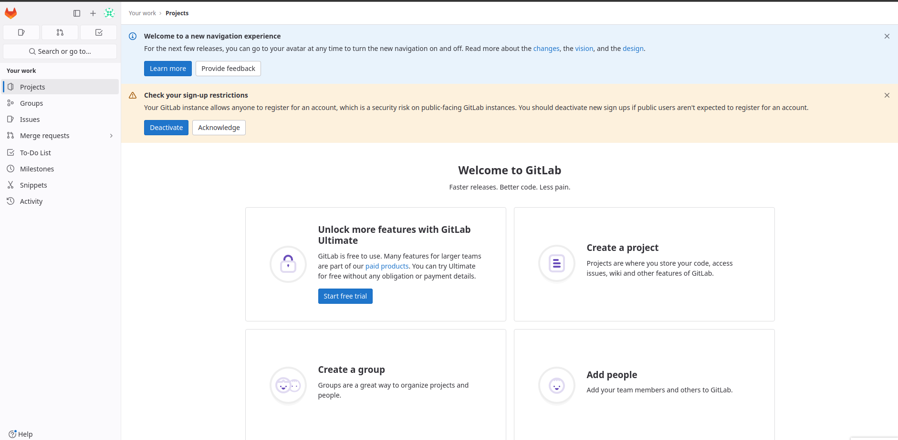

## Script to Configure GitLab on USB Device
I like to have my projects on a USB stick with a Git interface, so i make this very simple script to make it easy to set up.

### Important notes before running the script
* **Make sure to select the correct device**.
* Make sure to have a simple label for your device; **gitlab-usb** is a good one.
* Be careful with non-empty USB devices; **this script will delete any folder named "gitlab" at the root of your device!**
* Never unplug your USB while using the container, can corrupt your server.

### Use
1. `./configure /dev/sdXX`
2. Access **localhost:8050**
3. Log in with the user: **root** and the password: **5iveL!fe**

  

To close your server, just press Ctrl + C in your Docker running terminal. To reopen your GitLab server, go to your USB device in the GitLab folder and run `docker-compose up` when finished.

### Notes
* If you get error 502, just wait a little more, your server is loading.
* If take too long, maybe your usb stick corrupted some files.
* If you want to use the same GitLab server on any other machine, make sure to have the same label and GitLab version on the machine as well.
* You can put this repo folder inside your usb stick, if the server already exists, the script will ask if you want to start it.
